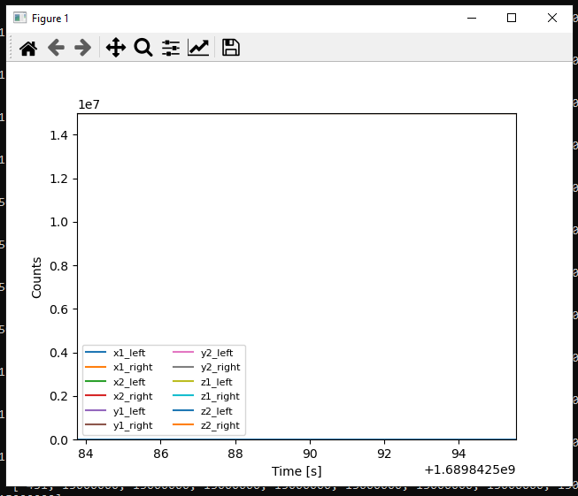

# Master SPI Tester

The project provides a way to test and evaluat the SPI communication of with the FPGA by using a Teensy 4.1 with an Arduino sketch to operate as an SPI Master.

The user can use directly the serial port of the Arduino, or the `master_spi_tester_cli.py` command line interface to send commands to the FPGA

# Getting Started

1. Connect the OBC cable from the Teensy connector to the FPGA board
2. Power on the board with the external power supply (confirm the shunt that powers the teensy from the USB 5V bus is cut).
3. Compile and Upload the `Master_SPI_Tester.ino` to the Teensy 4.1
4. Operate through serial port or the command line interface


# Operation

The Arduino code receives ascii commands and replies in ascii as well. This was decided for simplicity of implementation and considering a low throughput of data transmission.

The accepted commands are in ascii, and followed by the relevant parameters (integer bytes 8 bits) delimited by spaces such as the example below:

```
> # command param1 param2
> write_reg 5 255
b'5 7\r\n'
```

## Serial Port commands


### Read from register
 `read_reg REGISTER_ADDRESS` 

 Reads 1 byte from the `register_address` position and sends back through serial with the syntax `[register_address] [value]`, where the `value` is the byte stored in memory.

Example:
```
> read_reg 5 
5 7 
```


### Write to register 

`write_reg REGISTER_ADDRESS REGISTER_VALUE` 

Writes the `register_value` byte in the `register_address` memory position. It then reads the same register position and sends back the read value as in the `read_reg` command.

Example:
```
> write_reg 5 255
5 7 
```

### Read data

 `read_data`
 
 Reads the 12 memory positions corresponding to the data positions [`X0_left`, `X0_right`, ... , `Z1_left`, `Z1_right`]. Each of these positions is an integer of up to 24 bits.

Example:
```
> read_data
2352342 4324 42342 12312 3213 5345 23523 1231 31232 2434 2342 4636 
```

### Read memory sequence

 `read_memory REGISTER_ADDRESS LENGTH`
 
 Reads `length` number of bytes starting from `register_address` and replies each byte delimited by spaces

Example:
```
> read_memory 0 18
0 85 0 0 0 0 7 0 1 165 0 0 0 0 0 0 0 165 0
```


## Command Line Interface 

Using the `master_spi_tester_cli.py` tool.

Check the help command:

```
> python master_spi_tester_cli.py -h
usage: master_spi_tester_cli.py [-h] [-p PORT] [-b BAUD] [-st SERIAL_TIMEOUT] [-t TIMEOUT] [-w] [-r]
                                [-rd [READ_DATA]] [-rm] [-rl read_memory_length] [-a register_address]
                                [-v write_value] [-plot [PLOT]] [--plot_refresh_rate PLOT_REFRESH_RATE]
                                [-s [SAVE_FILE]] [-dac VACT|VEXC|VCOMP X1|X2|..|Z2 VALUE]
                                [--phase_delay PhaseDelay] [--en_oncyc enable_on_cycle_count]
                                [--en_onperiod enable_on_period]

Master SPI Tester for FPGA

options:
  -h, --help            show this help message and exit
  -p PORT, --port PORT  COM Port
  -b BAUD, --baud BAUD  Baud Rate
  -st SERIAL_TIMEOUT, --serial_timeout SERIAL_TIMEOUT
                        Serial port timeout
  -t TIMEOUT, --timeout TIMEOUT
                        Message reply timeout
  -w, --write           Write flag
  -r, --read            Read flag
  -rd [READ_DATA], --read_data [READ_DATA]
                        Reads 1 or the given number of samples of all data
  -rm, --read_memory    Read memory flag
  -rl read_memory_length, --read_memory_length read_memory_length
                        Read memory length
  -a register_address, --reg_addr register_address
                        Register address
  -v write_value, --reg_value write_value
                        Write_value
  -plot [PLOT], --plot [PLOT]
                        Plots the retreived read_data samples. Passed argument is number of samples to
                        plot.
  --plot_refresh_rate PLOT_REFRESH_RATE
                        Set the plot refresh rate
  -s [SAVE_FILE], --save_file [SAVE_FILE]
  --dac VACT|VEXC|VCOMP X1|X2|..|Z2 VALUE
                        Set respective DAC (16bit) register value. Example: -dac VACT X1 1024
  --phase_delay PhaseDelay
                        C2V Configuration. PhaseDelay: defines the delay between modulation and
                        demodualtion signals (delay = Nx7.2deg)
  --en_oncyc enable_on_cycle_count
                        C2V Configuration. EN_onCycCnt: defines the number of delay cycles between
                        demodualtion signal and the switch EN (delay = Nx20ns)
  --en_onperiod enable_on_period
                        C2V Configuration. EN_onPeriod: defines the number of cycles the EN stays active
                        (Period= Nx20ns)

```

### Serial configuration

The tool uses a the serial configuration stored in `master_spi_tester.ini`, which is updated everytime the tool is executed with explicit `--port`, `--baud`, or timeout arguments. The text configuration file may also be altered in notepad.

To set the port, baud rate and timeouts from the command line:

```
> python master_spi_tester_cli.py -p COM6 -b 9600 -st 1
Port is COM6
Baud Rate is 9600
Serial timeout is 1.0
```


### Read from register

Accepts HEX values for the register address and values 
Example:
```
> python master_spi_tester_cli.py -r -a 0x0
Port is COM6
Baud Rate is 9600
Serial timeout is 1.0
0 85
```


### Write to register 

Example:
```
> python master_spi_tester_cli.py -w -a 0x05 -v 0xff
Port is COM6
Baud Rate is 9600
Serial timeout is 1.0
5 7
```

### Read memory sequence

Example:
```
> python master_spi_tester_cli.py -rm -a 0x0 -rl 18
Port is COM6
Baud Rate is 9600
Serial timeout is 1.0
0 85 0 0 0 0 7 0 1 165 0 0 0 0 0 0 0 165 0 0 0 0 0 0 0
```


### Read data and Read data loop


The read data routine is triggered by the `-rd [Nsamples]` or `--read_data [Nsamples]` argument. 
If the `[Nsamples]` parameter is passed, the script loops to await and acquire that many samples, otherwise it acquires one.

The read data routine assumes that the FPGA has been previously correctly configured with the respective DAC and phase values.
It starts by setting the run mode as continous and then wakeup, which triggers the state machine to start the acquisition loop.

The read data loop checks if the FIFO count is more than zero and reads those data points. 

It is possible to plot the acquired data using the `--plot [plot_window]` argument, where `[plot_window]` is the number of samples plotted in the window, if ommited the default is 100 samples.

The read data loop can also save the data into a `.csv` file directly while acquiring using the `--save_file FILENAME.CSV` argument.

Example read a single line:
```
> python master_spi_tester_cli.py -rd
Port is COM6
Baud Rate is 115200
Serial timeout is 0.5
wakeup 0
mode 1
run 1
wakeup 1
count is:  5
1689842383.9927056       [-451, 15000000, 15000000, 15000000, 15000000, 15000000, 15000000, 15000000, 15000000, 15000000, 15000000, 15000000]

```

Example read 10 samples:
```
> python master_spi_tester_cli.py -rd 10
Port is COM6
Baud Rate is 115200
Serial timeout is 0.5
wakeup 0
mode 1
run 1
wakeup 1
count is:  5
1689842411.901133        [-309, 15000000, 15000000, 15000000, 15000000, 15000000, 15000000, 15000000, 15000000, 15000000, 15000000, 15000000]
count is:  4
1689842411.9091127       [-87, 15000000, 15000000, 15000000, 15000000, 15000000, 15000000, 15000000, 15000000, 15000000, 15000000, 15000000]
count is:  3
1689842411.9150977       [190, 15000000, 15000000, 15000000, 15000000, 15000000, 15000000, 15000000, 15000000, 15000000, 15000000, 15000000]
count is:  2
1689842411.921081        [499, 15000000, 15000000, 15000000, 15000000, 15000000, 15000000, 15000000, 15000000, 15000000, 15000000, 15000000]
count is:  1
1689842411.9290586       [809, 15000000, 15000000, 15000000, 15000000, 15000000, 15000000, 15000000, 15000000, 15000000, 15000000, 15000000]
count is:  0
1689842412.5100167       [1087, 15000000, 15000000, 15000000, 15000000, 15000000, 15000000, 15000000, 15000000, 15000000, 15000000, 15000000]
count is:  0
1689842413.1293805       [1309, 15000000, 15000000, 15000000, 15000000, 15000000, 15000000, 15000000, 15000000, 15000000, 15000000, 15000000]
count is:  0
1689842413.749236        [1451, 15000000, 15000000, 15000000, 15000000, 15000000, 15000000, 15000000, 15000000, 15000000, 15000000, 15000000]
count is:  0
1689842414.368163        [1500, 15000000, 15000000, 15000000, 15000000, 15000000, 15000000, 15000000, 15000000, 15000000, 15000000, 15000000]
count is:  0
1689842414.9888785       [1451, 15000000, 15000000, 15000000, 15000000, 15000000, 15000000, 15000000, 15000000, 15000000, 15000000, 15000000]

```

Example read 10 samples and saving data to `output.csv` file:
```
> python master_spi_tester_cli.py -rd 10 --save_file output.csv
Port is COM6
Baud Rate is 115200
Serial timeout is 0.5
Saving data samples to  output.csv
wakeup 0
mode 1
run 1
wakeup 1
count is:  5
1689842437.2027397       [1309, 15000000, 15000000, 15000000, 15000000, 15000000, 15000000, 15000000, 15000000, 15000000, 15000000, 15000000]
count is:  4
1689842437.2057302       [1087, 15000000, 15000000, 15000000, 15000000, 15000000, 15000000, 15000000, 15000000, 15000000, 15000000, 15000000]
count is:  3
1689842437.2117157       [809, 15000000, 15000000, 15000000, 15000000, 15000000, 15000000, 15000000, 15000000, 15000000, 15000000, 15000000]
count is:  2
1689842437.2167025       [500, 15000000, 15000000, 15000000, 15000000, 15000000, 15000000, 15000000, 15000000, 15000000, 15000000, 15000000]
count is:  1
1689842437.2206903       [190, 15000000, 15000000, 15000000, 15000000, 15000000, 15000000, 15000000, 15000000, 15000000, 15000000, 15000000]
count is:  0
1689842437.8120177       [-87, 15000000, 15000000, 15000000, 15000000, 15000000, 15000000, 15000000, 15000000, 15000000, 15000000, 15000000]
count is:  0
1689842438.4320636       [-309, 15000000, 15000000, 15000000, 15000000, 15000000, 15000000, 15000000, 15000000, 15000000, 15000000, 15000000]
count is:  0
1689842439.0509408       [-451, 15000000, 15000000, 15000000, 15000000, 15000000, 15000000, 15000000, 15000000, 15000000, 15000000, 15000000]
count is:  0
1689842439.6702845       [-500, 15000000, 15000000, 15000000, 15000000, 15000000, 15000000, 15000000, 15000000, 15000000, 15000000, 15000000]
count is:  0
1689842440.2901933       [-451, 15000000, 15000000, 15000000, 15000000, 15000000, 15000000, 15000000, 15000000, 15000000, 15000000, 15000000]
```

The `output.csv` file has:
```
#time,x1_left,x1_right,x2_left,x2_right,y1_left,y1_right,y2_left,y2_right,z1_left,z1_right,z2_left,z2_right
1689842437.202740,1309,15000000,15000000,15000000,15000000,15000000,15000000,15000000,15000000,15000000,15000000,15000000
1689842437.205730,1087,15000000,15000000,15000000,15000000,15000000,15000000,15000000,15000000,15000000,15000000,15000000
1689842437.211716,809,15000000,15000000,15000000,15000000,15000000,15000000,15000000,15000000,15000000,15000000,15000000
1689842437.216702,500,15000000,15000000,15000000,15000000,15000000,15000000,15000000,15000000,15000000,15000000,15000000
1689842437.220690,190,15000000,15000000,15000000,15000000,15000000,15000000,15000000,15000000,15000000,15000000,15000000
1689842437.812018,-87,15000000,15000000,15000000,15000000,15000000,15000000,15000000,15000000,15000000,15000000,15000000
1689842438.432064,-309,15000000,15000000,15000000,15000000,15000000,15000000,15000000,15000000,15000000,15000000,15000000
1689842439.050941,-451,15000000,15000000,15000000,15000000,15000000,15000000,15000000,15000000,15000000,15000000,15000000
1689842439.670285,-500,15000000,15000000,15000000,15000000,15000000,15000000,15000000,15000000,15000000,15000000,15000000
1689842440.290193,-451,15000000,15000000,15000000,15000000,15000000,15000000,15000000,15000000,15000000,15000000,15000000
```


Example read and plot samples:
```
> python master_spi_tester_cli.py -rd 1000 --plot 20 --plot_refresh_rate 2
Port is COM6
Baud Rate is 115200
Serial timeout is 0.5
wakeup 0
mode 1
run 1
wakeup 1
count is:  5
1689842573.2270744       [-309, 15000000, 15000000, 15000000, 15000000, 15000000, 15000000, 15000000, 15000000, 15000000, 15000000, 15000000]
count is:  4
1689842573.2310643       [-87, 15000000, 15000000, 15000000, 15000000, 15000000, 15000000, 15000000, 15000000, 15000000, 15000000, 15000000]
count is:  3
1689842573.2350533       [190, 15000000, 15000000, 15000000, 15000000, 15000000, 15000000, 15000000, 15000000, 15000000, 15000000, 15000000]
count is:  2
1689842573.2380457       [499, 15000000, 15000000, 15000000, 15000000, 15000000, 15000000, 15000000, 15000000, 15000000, 15000000, 15000000]
count is:  1
1689842573.2420352       [809, 15000000, 15000000, 15000000, 15000000, 15000000, 15000000, 15000000, 15000000, 15000000, 15000000, 15000000]
count is:  0
1689842573.8354802       [1087, 15000000, 15000000, 15000000, 15000000, 15000000, 15000000, 15000000, 15000000, 15000000, 15000000, 15000000]
count is:  0
1689842574.4559755       [1309, 15000000, 15000000, 15000000, 15000000, 15000000, 15000000, 15000000, 15000000, 15000000, 15000000, 15000000]
count is:  0
1689842575.0768151       [1451, 15000000, 15000000, 15000000, 15000000, 15000000, 15000000, 15000000, 15000000, 15000000, 15000000, 15000000]
count is:  0
1689842575.6967883       [1500, 15000000, 15000000, 15000000, 15000000, 15000000, 15000000, 15000000, 15000000, 15000000, 15000000, 15000000]
count is:  1
1689842576.7488828       [1451, 15000000, 15000000, 15000000, 15000000, 15000000, 15000000, 15000000, 15000000, 15000000, 15000000, 15000000]
count is:  0
1689842576.9352493       [1309, 15000000, 15000000, 15000000, 15000000, 15000000, 15000000, 15000000, 15000000, 15000000, 15000000, 15000000]
count is:  0
1689842577.555581        [1087, 15000000, 15000000, 15000000, 15000000, 15000000, 15000000, 15000000, 15000000, 15000000, 15000000, 15000000]
count is:  0
1689842578.174916        [809, 15000000, 15000000, 15000000, 15000000, 15000000, 15000000, 15000000, 15000000, 15000000, 15000000, 15000000]


...


``` 

If given, the `--plot_refresh_rate VALUE` sets the update rate in seconds of the plot.

The plot sets the `xlim` and `ylim` to the minimum and maximum values of the available data in the plot window.

The plot figure is:




### Configure parameters of the FPGA


#### Settings the DAC values

The FPGA controls the voltages set for the Actuation, the Excitation and the Compare Threshold of each channel [`x1` to `z2`] defined by its internal registers.

To set the respective DAC values use the `--DAC VACT|VEXC|VCOMP X1|X2|..|Z2 VALUE`.

The  routine writes and reads the written value from the register.

```
  --dac VACT|VEXC|VCOMP X1|X2|..|Z2 VALUE
                        Set respective DAC (16bit) register value. Example: -dac VACT X1 1024
```

Example:
```
> python master_spi_tester_cli.py --dac VACT x1 12345
Port is COM6
Baud Rate is 115200
Serial timeout is 0.5
VACT_X1 12345
```

#### Settings the phase delay and enable cycle delay values

These settings can be executed concurrently.

```
  --phase_delay PhaseDelay
                        C2V Configuration. PhaseDelay: defines the delay between modulation and
                        demodualtion signals (delay = Nx7.2deg)
  --en_oncyc enable_on_cycle_count
                        C2V Configuration. EN_onCycCnt: defines the number of delay cycles between
                        demodualtion signal and the switch EN (delay = Nx20ns)
  --en_onperiod enable_on_period
                        C2V Configuration. EN_onPeriod: defines the number of cycles the EN stays active
                        (Period= Nx20ns)
```


